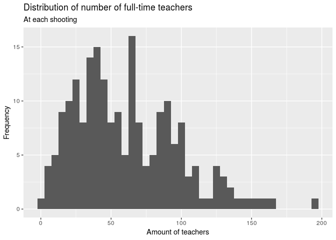
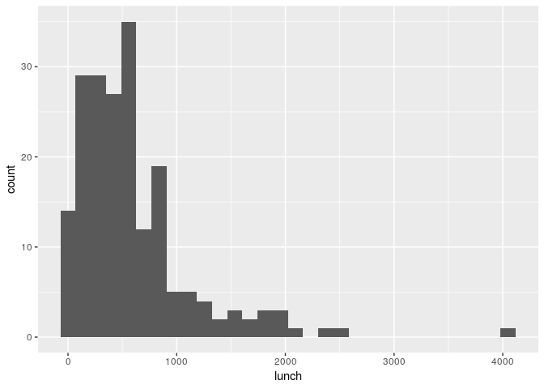

Exploratory Analysis of School Shootings
================
Significantly Different
March 29, 2018

    ## ── Attaching packages ────────────────────────────────────────── tidyverse 1.2.1 ──

    ## ✔ ggplot2 3.1.0     ✔ purrr   0.2.5
    ## ✔ tibble  2.0.0     ✔ dplyr   0.7.8
    ## ✔ tidyr   0.8.2     ✔ stringr 1.3.1
    ## ✔ readr   1.3.1     ✔ forcats 0.3.0

    ## ── Conflicts ───────────────────────────────────────────── tidyverse_conflicts() ──
    ## ✖ dplyr::filter() masks stats::filter()
    ## ✖ dplyr::lag()    masks stats::lag()

    ## Parsed with column specification:
    ## cols(
    ##   .default = col_character(),
    ##   uid = col_double(),
    ##   year = col_double(),
    ##   time = col_time(format = ""),
    ##   enrollment = col_number(),
    ##   killed = col_double(),
    ##   injured = col_double(),
    ##   casualties = col_double(),
    ##   age_shooter1 = col_double(),
    ##   shooter_deceased1 = col_double(),
    ##   age_shooter2 = col_double(),
    ##   shooter_deceased2 = col_double(),
    ##   white = col_number(),
    ##   black = col_double(),
    ##   hispanic = col_double(),
    ##   asian = col_double(),
    ##   american_indian_alaska_native = col_double(),
    ##   hawaiian_native_pacific_islander = col_double(),
    ##   two_or_more = col_double(),
    ##   resource_officer = col_double(),
    ##   lat = col_double()
    ##   # ... with 4 more columns
    ## )

    ## See spec(...) for full column specifications.

<!-- -->

<!-- -->

    ## # A tibble: 1 x 1
    ##   median_staff_num
    ##              <dbl>
    ## 1             54.5

We can also rank states by the number of school shootings that have
occurred there:

    ## # A tibble: 41 x 2
    ## # Groups:   state [41]
    ##    state              n
    ##    <chr>          <int>
    ##  1 California        28
    ##  2 Florida           17
    ##  3 Texas             14
    ##  4 Illinois          11
    ##  5 North Carolina    11
    ##  6 Pennsylvania      11
    ##  7 Louisiana         10
    ##  8 Ohio              10
    ##  9 Georgia            9
    ## 10 Michigan           8
    ## # … with 31 more rows

One more thing that would be interesting to see is the distribution of
the amount of students who qualify for free or reduced
    lunch.

    ## `stat_bin()` using `bins = 30`. Pick better value with `binwidth`.

<!-- -->

However, this might be misleading given that this is a raw number,
whereas a proportion would be more useful.

Your project goes here\! Before you submit, make sure your chunks are
turned off with `echo = FALSE`.

You can add sections as you see fit. Make sure you have a section called
Introduction at the beginning and a section called Conclusion at the
end. The rest is up to you\!
