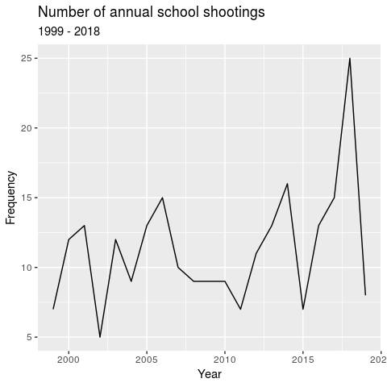
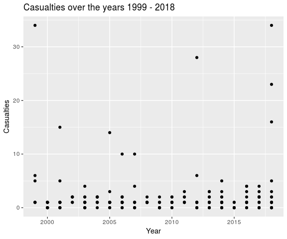
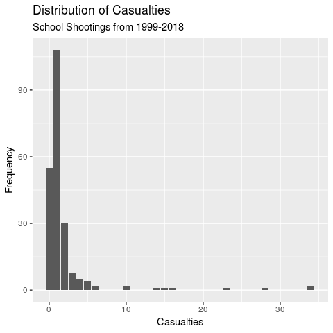

Exploratory Analysis of School Shootings
================
Significantly Different
March 29, 2018

## Section 1. Introduction

Gun control has been an issue of huge debate in the United States: from
individuals claiming that the possession of guns is necessary to protect
one’s own safety to others who claim that it’s a “right” bestowed by the
constitution, gun control seems to imply different things to different
people. With a huge market of gun sales being run by capitalism, it
doesn’t seem like any number of casualties caused by gun violence will
be sufficient to make up for the monetary loss a ban on guns would have
on our capitalist market — which is to some extent why we still have gun
control issues going on in the United States. Such issue of gun violence
has unfortunately been spilling into our schools, and school shootings
have become the issue of concern for teachers, school districts, and
families in hopes of never having to face such an incident. The lack of
control and support the government and community provided towards this
issue has unfortunately lead to schools carrying the burden of coming up
with preventative measures to ensure their students’ safety — a high
school in South Florida, for example, has brought up and implemented the
idea of a bullet-proof shelter to protect children from harm, and
another school in Texas asked the students to wear a clear backpack to
school. Despite such efforts, school shootings still break out, leading
researchers and school officials to increasingly work more to figure out
the best ways to prevent school shootings from occurring.

The primary focus of the current project is to look into the data of
school shootings from the past to evaluate what factors correlate to
higher number of casualties in school shootings, in hopes that this
analysis will help lead to identification of good preventive measures.
In addition, we will also be looking at whether our data is in line with
a study (Vossekuil et al., 2002) that analyzed 37 school shooting which
identified attackers as all male, 95% current student of the school, 81%
single attackers and that 76% of attackers used one weapon with 61% (of
all attackers) using handguns. As researchers claim that most firearms
in school shootings were acquired from a family member (Vossekuil et
al., 2002; Levin & Madfis, 2009), this analysis will also explore
whether such findings apply to the data we have.

Throughout this project, our team will look into the
`schools-shootings-data.csv` as provided by the Washington Post. The
data consists of any act of gunfire at schools (primary, secondary) that
occurred during school hours, or immediately before or after hours,
since the Columbine High massacre on April 20, 1999. As such, 221
incidences of school shootings have been included in the dataset. The
data was collected by using “Nexis, news articles, open-source
databases, law enforcement reports, information from school websites,
and calls to schools and police departments”, as according to Washington
Post. The variables included in this data are as follows:

uid, nces\_school\_id, school\_name, nces\_district\_id, district\_name,
date, school\_year, year, time, day\_of\_week, city, state,
school\_type, enrollment, killed, injured, casualties, shooting\_type,
age\_shooter1, gender\_shooter1, race\_ethnicity\_shooter1,
shooter\_relationship1, shooter\_deceased1, deceased\_notes1,
age\_shooter2, gender\_shooter2, race\_ethnicity\_shooter2,
shooter\_relationship2, shooter\_deceased2, deceased\_notes2, white,
black, Hispanic, Asian, American\_indian\_alaska\_native,
Hawaiian\_native\_pacific\_islander, two\_or\_more, resource\_officer,
weapon, weapon\_source, lat, long, staffing, low\_grade, high\_grade,
lunch, county, state\_fips, county\_fips, ulocale

More information on the description of these variables can be found
under the codebook in the `data` folder.

## Section 2. Data Analysis

In addition, we will also be looking at whether our data is in line with
a study (Vossekuil et al., 2002) that analyzed 37 school shooting which
identified attackers as all male, 95% current student of the school, 81%
single attackers and that 76% of attackers used one weapon with 61% (of
all attackers) using handguns. As researchers claim that most firearms
in school shootings were acquired from a family member (Vossekuil et
al., 2002; Levin & Madfis, 2009), this analysis will also explore
whether this finding apply to the data we have.

### Claims made by Previous Literature

##### Vossekuil’s Analysis of 37 School Shootings

### Frequency of Annual School Shootings

<!-- -->

### Number of Casualties Across the Years

<!-- -->

### Distribution of Casualties

<!-- -->

### Popular Types of Shootings

    ## # A tibble: 10 x 2
    ## # Groups:   shooting_type [10]
    ##    shooting_type                   n
    ##    <chr>                       <int>
    ##  1 targeted                      140
    ##  2 indiscriminate                 45
    ##  3 accidental                     28
    ##  4 unclear                         9
    ##  5 targeted and indiscriminate     6
    ##  6 public suicide                  4
    ##  7 accidental or targeted          2
    ##  8 hostage suicide                 2
    ##  9 public suicide (attempted)      1
    ## 10 <NA>                            1

Most of the shootings in our dataset were categorized as targeted.

### Popular Days

    ## # A tibble: 5 x 2
    ## # Groups:   day_of_week [5]
    ##   day_of_week     n
    ##   <chr>       <int>
    ## 1 Tuesday        55
    ## 2 Wednesday      53
    ## 3 Monday         48
    ## 4 Friday         45
    ## 5 Thursday       37

There seems to be minimal difference in the number of shootings among
days of the week, but Tuesday and Wednesday are the days with the most
school shootings taking place.

### Mutation of Variables

We wanted to manipulate some of our variables in order to make them more
useful. For example, many of our variables are raw and thus, converting
them to percentages will be more useful and standardized.

### Multivariate Regression Analysis

These are the variables that we will include in our model. We will then
use model selection in order to find the most appropriate model to
perform predictions.

Variables:

`day_of_week` `black_percent` `white_percent` `hispanic_percent`
`asian_percent` `enrollment` `lunch_percent`

``` shooting_type```

```

## 

## Call:

## lm(formula = casualties ~ day\_of\_week + black\_percent + white\_percent,

## data = school\_shootings)

## 

## Coefficients:

## (Intercept) day\_of\_weekMonday day\_of\_weekThursday

## 1.5614 -0.1165 -0.7555

## day\_of\_weekTuesday day\_of\_weekWednesday black\_percent

## 0.4715 -0.2698 -0.8502

## white\_percent

## 1.7832

\`\`\`

## Section 3. Discussion and Conclusion

Through this exploratory analysis, we identified some factors that
correlate to a higher number of casualties for school shootings:
`staffing`, `enrollment`, `lunch`, `resource_officer`. As correlation
does not imply causation, we would not go as far as to say that these
were the factors that caused more victims (e.g. the absence of a
resource officer may not have caused higher number of casualties, but it
makes s to be related with the number).

Your write up must also include a one to two page conclusion and
discussion. This will require a summary of what you have learned about
your research question along with statistical arguments supporting your
conclusions. Also critique your own methods and provide suggestions for
improving your analysis. Issues pertaining to the reliability and
validity of your data and appropriateness of the statistical analysis
should also be discussed here. A paragraph on what you would do
differently if you were able to start over with the project or what you
would do next if you were going to continue work on the project should
also be included.

uid, nces\_school\_id, school\_name, nces\_district\_id, district\_name,
date, school\_year, year, time, day\_of\_week, city, state,
school\_type, enrollment, killed, injured, casualties, shooting\_type,
age\_shooter1, gender\_shooter1, race\_ethnicity\_shooter1,
shooter\_relationship1, shooter\_deceased1, deceased\_notes1,
age\_shooter2, gender\_shooter2, race\_ethnicity\_shooter2,
shooter\_relationship2, shooter\_deceased2, deceased\_notes2, white,
black, Hispanic, Asian, American\_indian\_alaska\_native,
Hawaiian\_native\_pacific\_islander, two\_or\_more, resource\_officer,
weapon, weapon\_source, lat, long, staffing, low\_grade, high\_grade,
lunch, county, state\_fips, county\_fips, ulocale
