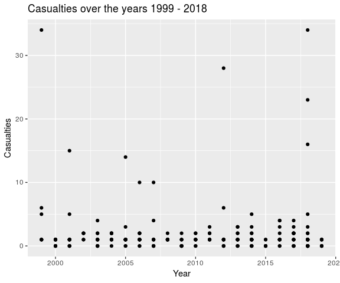
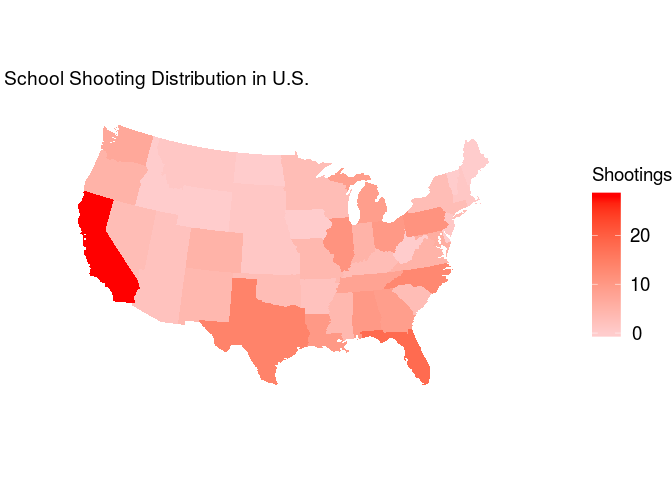

Exploratory Analysis of School Shootings
================
Significantly Different
March 29, 2018

## Section 1. Introduction

Gun control has been an issue of huge debate in the United States: from
individuals claiming that the possession of guns is necessary to protect
one’s own safety to others who claim that it’s a “right” bestowed by the
constitution, gun control seems to imply different things to different
people. With a huge market of gun sales being run by capitalism, it
doesn’t seem like any number of casualties caused by gun violence will
be sufficient to make up for the monetary loss a ban on guns would have
on our capitalist market — which is to some extent why we still have gun
control issues going on in the United States. Such issue of gun violence
has unfortunately been spilling into our schools, and school shootings
have become the issue of concern for teachers, school districts, and
families in hopes of never having to face such an incident. The lack of
control and support the government and community provided towards this
issue has unfortunately lead to schools carrying the burden of coming up
with preventative measures to ensure their students’ safety — a high
school in South Florida, for example, has brought up and implemented the
idea of a bullet-proof shelter to protect children from harm, and
another school in Texas asked the students to wear a clear backpack to
school. Despite such efforts, school shootings still break out, leading
researchers and school officials to increasingly work more to figure out
the best ways to prevent school shootings from occurring.

The primary focus of the current project is to look into the data of
school shootings from the past to evaluate what factors correlate to
higher number of casualties in school shootings, in hopes that this
analysis will help lead to identification of good preventive measures.
In addition, we will also be looking at whether our data is in line with
a study (Vossekuil et al., 2002) that analyzed 37 school shooting which
identified attackers as all male, 95% current student of the school, 81%
single attackers. As researchers claim that most firearms in school
shootings were acquired from a family member (Vossekuil et al., 2002;
Levin & Madfis, 2009), this analysis will also explore whether such
findings apply to the data we have.

Throughout this project, our team will look into the
`schools-shootings-data.csv` as provided by the Washington Post. The
data consists of any act of gunfire at schools (primary, secondary) that
occurred during school hours, or immediately before or after hours,
since the Columbine High massacre on April 20, 1999. As such, 238
incidences of school shootings have been included in the dataset. The
data was collected by using “Nexis, news articles, open-source
databases, law enforcement reports, information from school websites,
and calls to schools and police departments”, as according to Washington
Post. The variables included in this data are as follows:

uid, nces\_school\_id, school\_name, nces\_district\_id, district\_name,
date, school\_year, year, time, day\_of\_week, city, state,
school\_type, enrollment, killed, injured, casualties, shooting\_type,
age\_shooter1, gender\_shooter1, race\_ethnicity\_shooter1,
shooter\_relationship1, shooter\_deceased1, deceased\_notes1,
age\_shooter2, gender\_shooter2, race\_ethnicity\_shooter2,
shooter\_relationship2, shooter\_deceased2, deceased\_notes2, white,
black, Hispanic, Asian, American\_indian\_alaska\_native,
Hawaiian\_native\_pacific\_islander, two\_or\_more, resource\_officer,
weapon, weapon\_source, lat, long, staffing, low\_grade, high\_grade,
lunch, county, state\_fips, county\_fips, ulocale

More information on the description of these variables can be found
under the codebook in the `data` folder.

## Section 2. Data Analysis

### In Line with Previous Literature?

##### Vossekuil’s Study

    ## # A tibble: 3 x 4
    ##   gender_shooter1 gender_shooter2     n percentage
    ##   <chr>           <chr>           <int>      <dbl>
    ## 1 f               <NA>               10       4.50
    ## 2 m               m                   5       2.25
    ## 3 m               <NA>              207      93.2

    ## # A tibble: 32 x 3
    ##    shooter_relationship1                    n percentage
    ##    <chr>                                <int>      <dbl>
    ##  1 boyfriend of student                     1      0.532
    ##  2 brother of student                       1      0.532
    ##  3 dating mother of student                 1      0.532
    ##  4 ex-boyfriend of student                  1      0.532
    ##  5 father of football player                1      0.532
    ##  6 father of student                        1      0.532
    ##  7 fired teacher                            1      0.532
    ##  8 former boyfriend of student              1      0.532
    ##  9 former boyfriend of student's mother     1      0.532
    ## 10 former student                           7      3.72 
    ## # … with 22 more rows

Unlike the analysis presented in the study of Vossekuil et al. (2002)
that indicated all attackers as male, our data shows that 4.5% of the
first shooter were female, although there were no second shooters that
were female. Out of 222 observations where enough information was given
about the shooters, only 5 shootings had 2 shooters involved–which is
only 2.25%, leaving 97.75% of the attacks as being committed by single
attackers. This is a much bigger number compared to the 81% Vossekuil et
al. reported in their study. Also, although Vossekuil reported that 95%
of the attackers in their study were current students, in this data 125
out of 188 (66.5%) shootings were committed by current students, which
is a smaller proprotion than that observed by Vossekuil.

##### Weapons from Family Members?

    ## [1] 148

    ## # A tibble: 2 x 3
    ##   wepsource_fam     n percentage
    ##   <lgl>         <int>      <dbl>
    ## 1 TRUE             50       55.6
    ## 2 NA               40       44.4

    ## # A tibble: 2 x 3
    ##   wepsource_fam     n percentage
    ##   <lgl>         <int>      <dbl>
    ## 1 TRUE             43       75.4
    ## 2 NA               14       24.6

Of 238 observations, 148 observations do not have the source of weapon
included in the list. Of the remaining 90 observations, 50 were cases
where the shooter gained access to weapons through family members
(e.g. uncle, relatives, parents), which is 55.5% for the entire
observations. When narrowing this down to shooters who were current
students of the school, we get that 75.44% of the students get their
weapons from their family members or home, which is in line with the
literature that claim that most firearms in school shootings were
acquired from a family member (Vossekuil et al., 2002; Levin & Madfis,
2009)

### Mutation of Variables

We begin by manipulating some of our variables in order to make them
more useful. For example, many of our variables are raw and thus,
converting them to percentages will be more useful and standardized.

We create the following variables:

`white_percent` `black_percent` `hispanic_percent` `asian_percent`
`american_indian_alaska_native_percent` `school_type` `lunch_percent`
`locale_type`

### Frequency of Annual School Shootings

<!-- -->

### Number of Casualties Across the Years

<!-- -->

### Distribution of Casualties

<!-- -->

### School Shootings by State

Here is a visualization of school shootings per state in the
U.S.

<!-- -->

### Mean Casualties Estimation via Bootstrapping

# `{r bootstrap} # boot_dist <- school %>% #   # specify the variable of interest #   specify(response = rent) %>%  #   # generate 15000 bootstrap samples #   generate(reps = 15000, type = "bootstrap") %>%  #   # calculate the median of each bootstrap sample #   calculate(stat = "median") #`

### Multivariate Regression Analysis

Next, we eliminate variables that will not be useful in our model, such
as those used for logistical purposes.

These are the variables that we will include in our model:

`enrollment` `factor(shooting_type)` `staffing` `white_percent`
`black_percent` `hispanic_percent` `asian_percent` `lunch_percent`
`factor(resource_officer)` `factor(day_of_week)`

### Model Creation and Backwards Selection

We first create a full model, which includes all potential variables.
The `step()` function automates the backwards selection process for us.

`casualties ~ enrollment + factor(shooting_type) + staffing +
white_percent + black_percent + hispanic_percent + asian_percent +
lunch_percent + factor(resource_officer) + factor(day_of_week)`

The perfect model is shown below:

`casualties ~ enrollment + factor(shooting_type) + staffing +
lunch_percent + factor(resource_officer)`

Its adjusted r-squared value is 0.1699588.

### Testing of Model

### Conclusion

Our analysis found that the best model included the variables
`enrollment`, `shooting_type`, `staffing`, `lunch_percent` and
`resource_officer`.

## Section 3. Discussion and Conclusion

Through this exploratory analysis, we identified some variables that
correlate to a higher number of casualties for school shootings: the
number of full time teachers at time of shooting (`staffing`),
enrollment at school at time of shooting (`enrollment`), number of
students eligible for free or reduced price lunch (`lunch`), type of
shooting (`shooting_type`), and presence of resource officer or security
guard at time of shooting (`resource_officer`). As correlation does not
imply causation, we would not go as far as to say that these were the
factors that caused more victims (e.g. the absence of a resource officer
may not have directly caused higher number of casualties). Also, with an
adjusted r-squared value of 0.169, only about 17% of variability in
number of casualties can be explained by these 5 variables.

Some possible explanations as to why the 5 variables were best
predictors of number of casualties is as follows: the more full time
teachers there were at the time of shooting, the more possible it would
have been for teachers to collectively protect the students and follow
emergency guidelines; more students being enrolled on school would lead
to more potential victims; and indiscriminate shooting would have lead
to more casualties than targeted shooting. The resource officer being
present being correlated to more number of casualties is interesting and
difficult to explain. Perhaps the officer being present may have somehow
either triggered the students to commit more shootings out of fear,
maybe the fact that the school had an officer was indicative of the
school experiencing trouble with violence, or as indicated in the
literature (Addington, 2009), having security measures in school may
have lead to the school feeling like prison for the students, causing
more emotional distress and resentment. The `lunch` variable is also
interesting in that it shows how schools with a greater proportion of
students receiving free lunch have fewer number of casualties during
shootings. Although it is hard to explain why this is the case from the
given data, one possibility is that these schools had better preventive
measures established prior to the shooting occurrence.

A few limitations exist in this analysis. First, our data may have
potentially been unreliable, as it got information from that available
to the public–at times, the gender or age of the shooters wasn’t
reported, for example. Also, there were several variables and data that
would have been interesting to look at to provide a fuller understanding
of our analysis such as “rate of reported bullying”, as the literature
suggests bullying as one of the main causes of school shootings.
Although the `lunch` variable is indicative of the SES status of the
students in the school, an “average/median family income” would have
helped better explain the significance of this variable. Finally,
because we didn’t have any data for schools that don’t have shootings,
we were not able to analyze and assess how schools that experienced
shootings were different from those that did not. More information on
what type of preventive measures were in schools prior to the shooting
would have also been interesting to see how effective these measures are
(for our current data, we only have the variable `resource_officer` for
this). If we were able to start over with the project, we would have
addressed the aforementioned issues with the data. In terms of
statistical analysis, although we looked at the number of casualties in
a numerical perspective, we could have looked at it in a categorical way
by comparing schools that had shootings with no casualties to schools
that had shootings with one or more casualties.
