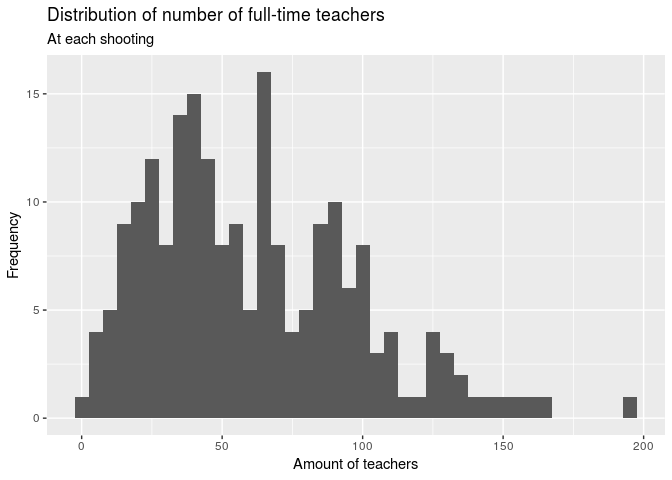

Exploratory Analysis of School Shootings
================
Significantly Different
March 29, 2019

## Section 1. Introduction

Gun control has been an issue of huge debate in the United States: from
individuals claiming that the possession of guns is necessary to protect
one’s own safety to others who claim that it’s a “right” bestowed by the
constitution, “gun control” seems to imply different things to everyone.
With a huge market of gun sales being run by capitalism, it doesn’t seem
like any number of casualties caused by gun violence would be sufficient
to make up for the number of dollars a ban on guns would have on our
capitalist market—which is to some extent why we still have gun control
issues going on in the United States. Such issue of gun violence has
unfortunately been spilling into our schools, and school shootings has
become the issue of concern for teachers, school districts, and families
in hopes of never having to face such an incident. The lack of control
and support the government and community provided towards this issue has
unfortunately lead to schools carrying the burden of coming up with
preventive measures for school shootings to ensure students’ safety—a
high school in South Florida, for example, has brought up and
implemented the idea of a bullet-proof shelter to protect children from
harm, and another school in Texas asked the students to wear a clear
backpack to school. Despite such efforts, school shootings still
breakout, leading researchers and school officials to increasingly work
more to figure out the best ways to prevent school shootings from
occurring.

The aim of the current project is to look into data of school shootings
from the past to evaluate what factors correlate to higher number of
casualties in school shootings, in hopes that this analysis would help
lead to preventive measures.

Throughout this project, our team will look into the
`schools-shootings-data.csv` as provided by the Washington Post. The
data consists of any act of gunfire at schools (primary, secondary) that
occurred during school hours, or immediately before or after hours,
since the Columbine High massacre on April 20, 1999. As such, 221
incidences of school shootings have been included in the dataset. The
data was collected by using “Nexis, news articles, open-source
databases, law enforcement reports, information from school websites,
and calls to schools and police departments”, as according to Washington
Post. The variables included in this data are as follows:

uid, nces\_school\_id, school\_name, nces\_district\_id, district\_name,
date, school\_year, year, time, day\_of\_week, city, state,
school\_type, enrollment, killed, injured, casualties, shooting\_type,
age\_shooter1, gender\_shooter1, race\_ethnicity\_shooter1,
shooter\_relationship1, shooter\_deceased1, deceased\_notes1,
age\_shooter2, gender\_shooter2, race\_ethnicity\_shooter2,
shooter\_relationship2, shooter\_deceased2, deceased\_notes2, white,
black, Hispanic, Asian, American\_indian\_alaska\_native,
Hawaiian\_native\_pacific\_islander, two\_or\_more, resource\_officer,
weapon, weapon\_source, lat, long, staffing, low\_grade, high\_grade,
lunch, county, state\_fips, county\_fips, ulocale

More information on the description of these variables can be found
under the codebook in the README file.

## Section 2. Data analysis plan

For our analysis, we plan to use variables that seem likely to have an
influence on the number of casualties. Our response (dependent) variable
will be the number of casualties while the explanatory (independent)
variables will range from 1 to 50, according to the variables we decide
to include and that have an effect on the number of casualties. We might
use comparison groups that relate to income, race or type of high
school. However, this is not finalized.

Now we perform some preliminary exploratory data analysis by showing
summary statistics and visualizations:

``` r
library(tidyverse)
```

``` r
school_shootings <- read_csv("../project/school-shootings-data.csv")
```

We start by observing the distribution of casualties (our response
variable): <!-- --> This
will be useful as we would want to see what the median/mean number of
casualties is as well as the general shape of our distribution. It looks
like it is skewed to the right, which means we would look at the median:

    ## # A tibble: 1 x 1
    ##   median
    ##    <dbl>
    ## 1      1

The median of number of casualties is 1.

Next, we see the distribution of school staffing:

<!-- --> Because this
distribution is slightly skewed, we stick to the median.

    ## # A tibble: 1 x 1
    ##   median_staff_num
    ##              <dbl>
    ## 1             54.5

The median number of staff at schools is 54.53. This variable is useful
because much of media coverage around school shooters mentions mental
health and social support. It would be interesting to see if a higher
number of staffing is correlated to lower or higher number of
casualties.

We can also rank states by the number of school shootings that have
occurred there:

    ## # A tibble: 41 x 2
    ## # Groups:   state [41]
    ##    state              n
    ##    <chr>          <int>
    ##  1 California        28
    ##  2 Florida           17
    ##  3 Texas             14
    ##  4 Illinois          11
    ##  5 North Carolina    11
    ##  6 Pennsylvania      11
    ##  7 Louisiana         10
    ##  8 Ohio              10
    ##  9 Georgia            9
    ## 10 Michigan           8
    ## # … with 31 more rows

This variable is useful to observe the effect of states’ gun control
laws on the number of casualties or shootings happening.

One more thing that would be interesting to see is the distribution of
the amount of students who qualify for free or reduced
    lunch.

    ## `stat_bin()` using `bins = 30`. Pick better value with `binwidth`.

<!-- --> However, this
might be misleading given that this is a raw number, whereas a
proportion would be more useful.

## Section 3. Data

Our data was not put in the `/data` folder since it started giving us
issues (the R chunk would not find the data because there is a project
folder under the larger project folder). Our codebook and dimensions
were put in the README file.
